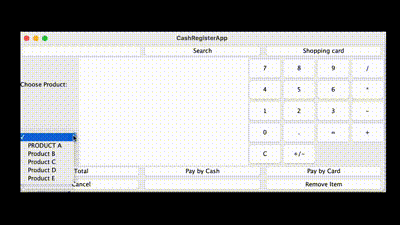

# Cash Register App

Cash Register App is a desktop application designed to manage a cash register system,
allowing users to select products from a database, add them to a shopping cart,
remove them as needed, and calculate the total cost of the transaction.
Additionally, the application provides an option to generate a receipt in TXT format.





## Features
1. #### Select products from database:
    - Browse available products and add them to the shopping cart.
2. #### Manage the shopping cart:
    - Add or remove products from the cart at any time.
3. #### Calculate total cost:
    - Automatically calculate the total cost of the items in the cart.
4. #### Generate a receipt:
    - Option to generate a purchase receipt in TXT format
5. #### User-firendly interface:
    - A simple and intuitive desktop application for easy use.


## Technologies
1. #### Java:
    - The main programming language used to develop the application.
2. #### Maven:
    - A build automation tool used for managing the project and dependencies.
3. #### MySQL Connector:
    - A library that enables the application to connect to a MySQL database.


## Installation
Ensure the following are installed:

- [Maven](https://maven.apache.org/download.cgi)
- [MySQL](https://dev.mysql.com/downloads/installer/)
- [XAMPP](https://www.apachefriends.org/download.html) (optional for database management)
- [Java 21 or newer](https://www.oracle.com/java/technologies/downloads/) (if you have a newer version of Java, update the `pom.xml` file accordingly)


Follow these steps to set up and run the project:

1. **Clone the repository:**

   Open your terminal and run:

   ```bash
   git clone https://github.com/kTurek95/CashRegisterApp.git
   ```

2. **Open the folder in your IDE:**

   Open the cloned folder in VS Code or IntelliJ.

3. **Copy .env.example to .env:**
   - on Windows:
   ```bash
   copy .env.example .env
   ```
   - on macOS:
   ```bash
   cp .env.example .env
   ```

4. **Configure database settings:**

   The .env file contains default settings for connecting to the MySQL database. The application expects a database running on port 3306 with the name cashregisterapp.

5. **Start XAMPP:**

   Launch XAMPP, then in the XAMPP control panel, start the MySQL and Apache modules. Apache is needed to access phpMyAdmin.
  
6. **Access phpMyAdmin:**

   Go to http://localhost/phpmyadmin/ or click the "Admin" button next to MySQL in the XAMPP control panel.

7. **Create the Database:**

   In phpMyAdmin, create a new database named CashRegisterApp.

8. **Import the Database Schema:**

   Navigate to the "Import" tab in phpMyAdmin and import the `Products.sql` file provided in the project.

9. **Run the Application:**

   In your IDE, first run Server.main to start the server, then run Main.java to launch the graphical user interface with the loaded products.

## Notes
- Ensure that all paths in the .env file are correctly set up according to your local environment.
- The server should be running before launching the main application to ensure connectivity and functionality.

## Support

If you encounter any issues with my software, please reach out to me:

Email: k.turek1995@gmail.com

## License

This project is licensed under the MIT License -
[](https://opensource.org/licenses/MIT)
